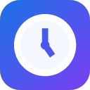

# Screen Time — Website Tracker, Limits & Focus

A privacy-first Chrome extension that shows where your time goes, enforces
daily limits, and helps you focus. Built with vanilla JS, Manifest V3, zero
dependencies. All data stays on your device.

## Features

- **Live time tracking** — per-site timers with second precision; the toolbar
  badge shows time on the current site
- **Smart activity detection** — counts only when you actually use the page
  (interaction or media playing); background music/videos keep counting,
  idle tabs don't
- **Daily limits** — set minutes per site, get a notification when you cross,
  optionally hard-block the site with a snooze escape hatch
- **Focus sessions** — 25/50-minute blocks of all limited sites, countdown badge
- **Insights dashboard** — 7-day stacked charts, category donut, productivity
  score, hourly heatmap, streaks, CSV/JSON export
- **Break reminders** — nudge after continuous browsing
- **Weekly report** — Sunday summary notification with trend vs. last week
- **100% local** — no servers, no analytics, no accounts ([privacy policy](PRIVACY.md))

## Install (developer mode)

1. Open `chrome://extensions`
2. Enable **Developer mode**
3. **Load unpacked** → select this folder

## Architecture

| File | Role |
|---|---|
| `background.js` | Service worker: tracking engine, limits, blocking, badge, alarms |
| `activity.js` | Content script: page-interaction detection |
| `popup.*` | Toolbar popup: live stats, limits, focus, settings |
| `stats.*` | Insights dashboard (full tab) |
| `blocked.*` | Block page with snooze |
| `welcome.*` | First-run onboarding |

Data model: time bucketed per day per domain in `chrome.storage.local`,
30-day retention, daily auto-reset by construction.

## Author

[Harisankar](https://www.linkedin.com/in/harisankarrpm/)
